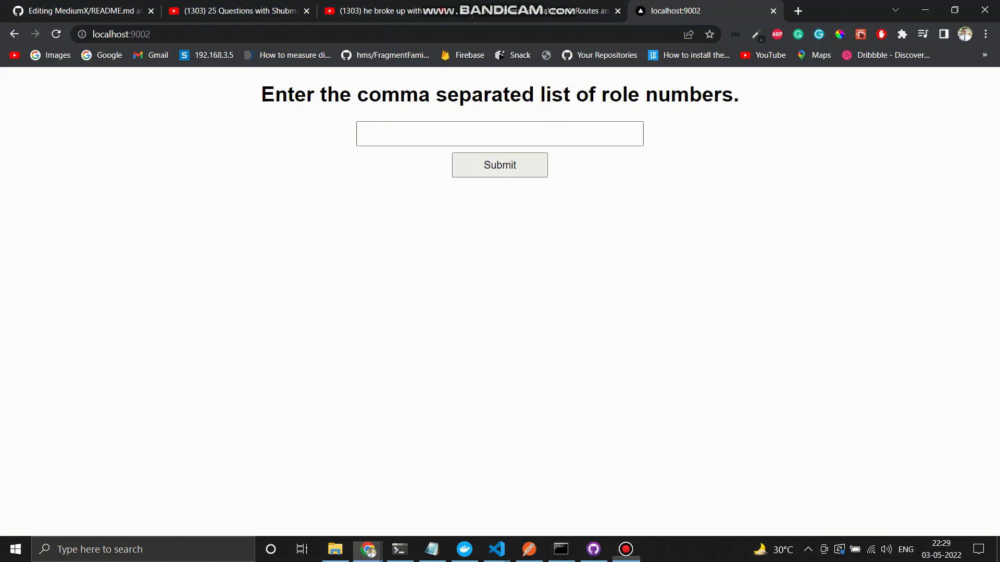

# TTT Assignment

## Dev Server

- To start the backend server run the following commands from the project root directory.

```
cd ttt_backend
npm install
npm run dev
```

- To start the frontend server run the following commands from the project root directory

```
cd ttt-next
npm install
npm run dev
```

## Libraries Used

- Backend

  - axios
  - cors
  - dotenv
  - express

- Frontend
  - next
  - react
  - axios
  - react-icons

## Components Explanation

### Backend

- All sensitive information is stored written inside .env file (For eg. PORT, REMOTE_URL)

- `config/index.js`: Setup to support api calling is done here. Body-parser, cors and routes are setup inside this file. And on calling `boot()` the express server starts.

- `routes/resultRouter.js`: This file includes the list of routes to forward supported requests to appropriate controller functions

- `routes/resultController.js`: Controller functions to get the requested data from the REMOTE_URl and return it to the user.

- `getResults()` function inside resultController.js file.
  - This function takes an array of roll numbers as body and it makes requests for each roll number concurrently and waits for the each result using Promise.all().

### Frontend

- `util/http-common.js`: This file setups the common axios method to perform api call to the backend server.

- `util-components`: This folder has util components which are used to give feedback to the users. (Eg. Loader, error message component, etc).

- `hooks/requests/useAxiosPost.js`: This hooks makes the post request to the URL passed with the payload. And returns state of the api request i.e. `loading, error, data`;

- `hooks/useHome`: Custom hook for home page of website which has state and function to support onClick and onChange event on buttons and input field respectively. This hook returns these event handlers and also axios request data to the `index.jsx` page.

## Results

Input: 5,6,9,12,18,20,25,30,32,36,37,38,40,42,45,47,49,50


